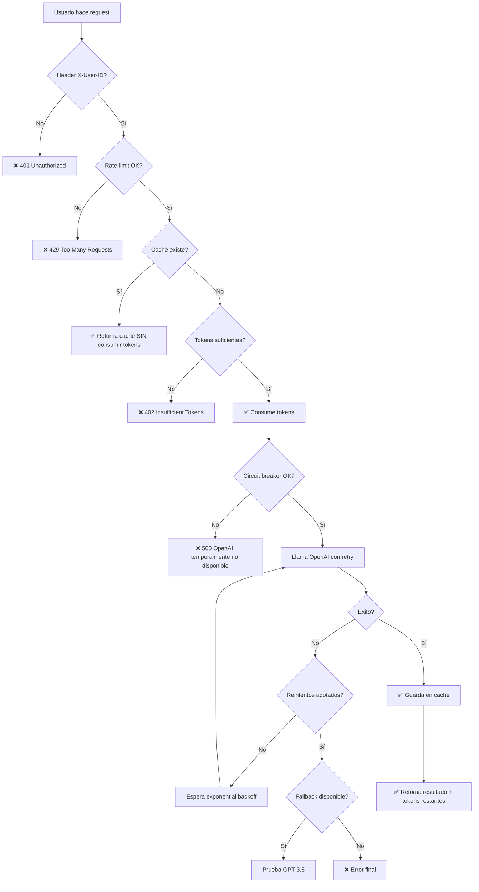

# 🎫 Sistema de Tokens - Easy Go

## Descripción General

Easy Go implementa un **sistema de tokens simple** para controlar el uso de la API y proteger contra:
- ❌ Solicitudes duplicadas (cacheo inteligente)
- ❌ Sobrecarga del servidor (rate limiting)
- ❌ Costos excesivos de OpenAI (circuit breaker + retry)
- ❌ Abuso del servicio (límite de tokens por usuario)

---

## 🎯 Características del Sistema

### 1. **Token Management** (Sin Base de Datos)
- ✅ **5 tokens gratis** al crear usuario
- ✅ Sistema de tokens en memoria (no requiere Redis)
- ✅ Tracking de uso por usuario
- ✅ Persistencia en memoria durante ejecución del servidor

### 2. **Rate Limiting Simple**
- ✅ **10 solicitudes por minuto** por usuario
- ✅ Sin slowapi ni librerías externas
- ✅ Limpieza automática de timestamps antiguos

### 3. **Request Deduplication (Caché)**
- ✅ **10 minutos** de caché por solicitud
- ✅ Hash único: `user_id + endpoint + data`
- ✅ Sin Redis: caché en memoria con TTL
- ✅ Limpieza automática de caché expirado

### 4. **OpenAI Retry Logic**
- ✅ **3 reintentos** con exponential backoff
- ✅ Delay: 1s → 2s → 4s (max 10s)
- ✅ Fallback automático: GPT-4 → GPT-3.5
- ✅ Solo reintenta errores recuperables (500, 503, 429, timeout)

### 5. **Circuit Breaker**
- ✅ **5 fallos** consecutivos → OPEN state
- ✅ **60 segundos** de timeout antes de reintentar
- ✅ Estados: CLOSED (ok) → OPEN (bloqueado) → HALF_OPEN (probando)
- ✅ Reset automático en éxito

---

## 💰 Costos de Tokens por Endpoint

| Endpoint | Costo | Descripción |
|----------|-------|-------------|
| `POST /api/cv/suggestions` | **1 token** | Sugerencias basadas en oferta de trabajo |
| `POST /api/cv/optimize` | **2 tokens** | Optimización completa del CV con GPT-4 |
| `POST /api/cv/generate` | **2 tokens** | Generar PDF con optimización IA |
| `POST /api/cv/generate-without-optimization` | **1 token** | PDF rápido sin IA |

---

## 🔧 Uso del Sistema

### **1. Autenticación Simple**

Todos los endpoints protegidos requieren el header `X-User-ID`:

```bash
curl -X POST http://localhost:8000/api/cv/suggestions \
  -H "Content-Type: application/json" \
  -H "X-User-ID: user_123" \
  -d '{"job_description": "..."}'
```

### **2. Consultar Balance de Tokens**

```bash
GET /api/user/tokens
Header: X-User-ID: user_123
```

**Respuesta:**
```json
{
  "success": true,
  "user_id": "user_123",
  "tokens_remaining": 3,
  "total_requests": 2,
  "created_at": "2025-01-09T10:30:00",
  "last_used": "2025-01-09T10:35:00"
}
```

### **3. Respuestas con Token Info**

Todos los endpoints retornan información de tokens:

```json
{
  "success": true,
  "suggestions": "...",
  "cached": false,
  "tokens_remaining": 4,
  "model_used": "gpt-4-turbo-preview",
  "tokens_used": 1250
}
```

### **4. Caché Automático**

Si haces la **misma solicitud** dentro de 10 minutos:

```json
{
  "success": true,
  "suggestions": "...",
  "cached": true,  // ✅ No se consumen tokens adicionales
  "tokens_remaining": 4
}
```

---

## ⚠️ Códigos de Error

| Código | Error | Solución |
|--------|-------|----------|
| **401** | Missing X-User-ID header | Agregar header con identificador único |
| **402** | Insufficient tokens | Usuario necesita comprar más tokens |
| **429** | Rate limit exceeded | Esperar hasta 1 minuto |
| **500** | Circuit breaker OPEN | OpenAI API temporalmente no disponible |

---

## 📊 Estadísticas del Sistema

```bash
GET /api/system/stats
```

**Respuesta:**
```json
{
  "success": true,
  "token_system": {
    "total_users": 150,
    "cached_requests": 45,
    "total_tokens_consumed": 320
  },
  "circuit_breaker": {
    "state": "CLOSED",
    "failures": 0,
    "threshold": 5,
    "last_failure": null
  }
}
```

---

## 🏗️ Arquitectura

### **Token Manager** (`services/token_service.py`)
```python
class TokenManager:
    user_tokens: Dict[str, dict]      # Tokens por usuario
    request_cache: Dict[str, dict]    # Caché de solicitudes
    rate_limits: Dict[str, list]      # Timestamps de rate limiting
    
    INITIAL_TOKENS = 5                # Tokens iniciales gratis
    CACHE_EXPIRY_MINUTES = 10         # TTL del caché
    RATE_LIMIT_REQUESTS = 10          # Max requests/minuto
```

### **OpenAI Service with Retry** (`services/openai_service_retry.py`)
```python
class OpenAIServiceWithRetry:
    MAX_RETRIES = 3                   # Máximo reintentos
    BASE_DELAY = 1                    # Delay inicial (segundos)
    MAX_DELAY = 10                    # Delay máximo
    DEFAULT_MODEL = "gpt-4-turbo-preview"
    FALLBACK_MODEL = "gpt-3.5-turbo"
    
    circuit_breaker: CircuitBreaker   # Protección contra fallos
```

### **Circuit Breaker** (`services/openai_service_retry.py`)
```python
class CircuitBreaker:
    failure_threshold = 5             # Fallos antes de OPEN
    timeout = 60 seconds              # Tiempo antes de reintentar
    state: "CLOSED" | "OPEN" | "HALF_OPEN"
```

---

## 🔄 Flujo de una Solicitud



---

## 🚀 Ventajas de esta Implementación

### ✅ **Simplicidad**
- **Sin Redis**: Todo en memoria
- **Sin Celery**: Sin workers ni queues
- **Sin slowapi**: Rate limiting manual

### ✅ **Eficiencia**
- **Caché inteligente**: Reduce llamadas a OpenAI
- **Deduplicación**: Misma request = mismo resultado
- **Retry automático**: Tolera fallos temporales

### ✅ **Protección**
- **Rate limiting**: Previene abuso
- **Circuit breaker**: Protege cuando OpenAI falla
- **Token system**: Control de uso por usuario

### ✅ **Transparencia**
- **Headers de respuesta**: Usuario ve tokens restantes
- **Indicador de caché**: Usuario sabe si fue cached
- **Estadísticas**: Admin puede monitorear sistema

---

## ⚙️ Configuración

En `token_service.py`:

```python
# Configuración del sistema
INITIAL_TOKENS = 5              # Tokens gratis al crear usuario
CACHE_EXPIRY_MINUTES = 10       # TTL del caché
RATE_LIMIT_REQUESTS = 10        # Max requests por minuto
RATE_LIMIT_WINDOW = 60          # Ventana de rate limit (segundos)
```

En `openai_service_retry.py`:

```python
# Configuración de retry
MAX_RETRIES = 3                 # Máximo reintentos
BASE_DELAY = 1                  # Delay inicial (segundos)
MAX_DELAY = 10                  # Delay máximo

# Configuración de circuit breaker
failure_threshold = 5           # Fallos antes de OPEN
timeout_seconds = 60            # Timeout antes de reintentar
```

---

## 📝 Frontend Integration

Actualizar `apiService.js` para enviar `X-User-ID`:

```javascript
// src/services/apiService.js
import { supabase } from '../lib/supabase';

async function getUserId() {
  const { data: { user } } = await supabase.auth.getUser();
  return user?.id || 'anonymous';
}

async function fetchWithAuth(url, options = {}) {
  const userId = await getUserId();
  
  return fetch(url, {
    ...options,
    headers: {
      ...options.headers,
      'X-User-ID': userId
    }
  });
}

// Uso
const response = await apiService.post('/api/cv/suggestions', {
  job_description: jobDesc
});

console.log('Tokens restantes:', response.tokens_remaining);
```

---

## 🎓 Testing

### **1. Test de Rate Limiting**

```bash
# Hacer 11 requests en < 1 minuto (debería fallar la 11va)
for i in {1..11}; do
  curl -X POST http://localhost:8000/api/cv/suggestions \
    -H "X-User-ID: test_user" \
    -H "Content-Type: application/json" \
    -d '{"job_description": "test"}' &
done
```

### **2. Test de Tokens**

```bash
# 1. Ver tokens iniciales (5)
curl -X GET http://localhost:8000/api/user/tokens \
  -H "X-User-ID: test_user"

# 2. Consumir 1 token (suggestions)
curl -X POST http://localhost:8000/api/cv/suggestions \
  -H "X-User-ID: test_user" \
  -H "Content-Type: application/json" \
  -d '{"job_description": "Software Engineer at Google"}'

# 3. Ver tokens restantes (4)
curl -X GET http://localhost:8000/api/user/tokens \
  -H "X-User-ID: test_user"
```

### **3. Test de Caché**

```bash
# 1. Primera request (consume token)
curl -X POST http://localhost:8000/api/cv/suggestions \
  -H "X-User-ID: test_user" \
  -H "Content-Type: application/json" \
  -d '{"job_description": "Python Developer"}'
# Respuesta: "cached": false, "tokens_remaining": 4

# 2. Misma request (NO consume token, usa caché)
curl -X POST http://localhost:8000/api/cv/suggestions \
  -H "X-User-ID: test_user" \
  -H "Content-Type: application/json" \
  -d '{"job_description": "Python Developer"}'
# Respuesta: "cached": true, "tokens_remaining": 4
```

---

## 🔮 Futuras Mejoras (Opcional)

Si el tráfico crece, considerar:

1. **Redis para caché persistente**
   - Sobrevive reinicios del servidor
   - Compartido entre múltiples instancias

2. **Celery para task queue**
   - Procesar PDFs en background
   - Mejor escalabilidad

3. **Base de datos para tokens**
   - Persistencia real de tokens
   - Historial de transacciones

4. **Stripe para pagos**
   - Comprar paquetes de tokens
   - Planes premium

---

## 📞 Contacto

¿Dudas sobre el sistema de tokens? Abre un issue en GitHub.

**Versión:** 1.0.0  
**Última actualización:** 9 de enero, 2025
